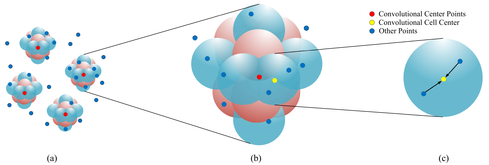
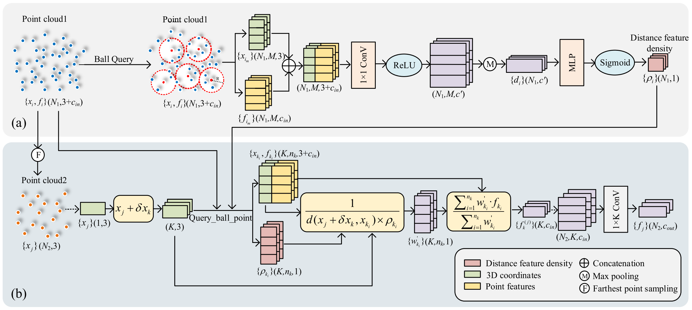
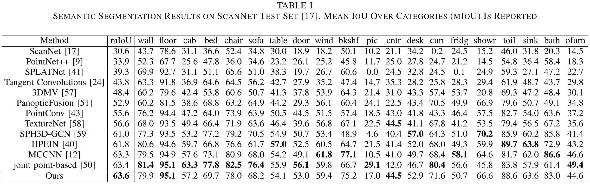
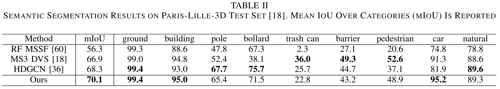

**Spherical Interpolated Convolutional Network With Distance–Feature Density for 3-D Semantic Segmentation of Point Clouds (T-cyb 2021)**
==============================================================================================================================
This is the official implementation of SiConv (IEEE Transactions on Cybernetics 2021), an end-to-end spherical interpolated convolutional network for 3-D semantic segmentation of point clouds created by Guangming Wang ,  Yehui Yang , Huixin Zhang, Zhe Liu , and Hesheng Wang.




## Citation
If you find our work useful in your research, please cite:

    	@ARTICLE{9606554,  
    	author={Wang, Guangming and Yang, Yehui and Zhang, Huixin and Liu, Zhe and Wang, Hesheng},  
    	journal={IEEE Transactions on Cybernetics},   
    	title={Spherical Interpolated Convolutional Network With Distance-Feature Density for 3-D Semantic Segmentation of Point Clouds},   
    	year={2021},  
    	volume={},  
    	number={},  
    	pages={1-11},  
    	doi={10.1109/TCYB.2021.3124954}}

## Abstract

The semantic segmentation of point clouds is an important part of the environment perception for robots. However, it is difficult to directly adopt the traditional 3-D convolution kernel to extract features from raw 3-D point clouds because of the unstructured property of point clouds. In this article, a spherical interpolated convolution operator is proposed to replace the traditional grid-shaped 3-D convolution operator. In addition, this article analyzes the defect of point cloud interpolation methods based on the distance as the interpolation weight and proposes the self-learned distance–feature density by combining the distance and the feature correlation. The proposed method makes the feature extraction of the spherical interpolated convolution network more rational and effective. The effectiveness of the proposed network is demonstrated on the 3-D semantic segmentation task of point clouds. Experiments show that the proposed method achieves good performance on the ScanNet dataset and Paris-Lille-3D dataset. The comparison experiments with the traditional grid-shaped 3-D convolution operator demonstrated that the newly proposed feature extraction operator improves the accuracy of the network and reduces the parameters of the network. 

## Prerequisites
    python 2.7.12
    CUDA 10.2
    cuDNN 7.4.1
    TensorFlow 1.11.0  
    numpy 1.14.5  
    g++ 5.4.0 

Or, you can pull the docker image and run the docker container

```
docker pull miiiino/warehouse:latest
```
## Usage

#### Dataset

Download the ScanNetv2 dataset from [here](http://www.scan-net.org/), and see `scannet/README` for details of preprocessing.

#### Compile Customized TF Operators

Please run

```
sh compile.sh 
```

The script file compiles TF operators included under `tf_ops` .

#### Training

Please run 

```
sh command_train.sh  
```

Please remind to specify the `gpu` , `model`(path to SiConv model), `data_root`(path to dataset), `log_dir` in the scripts.

Noted: It takes about five minutes to load the dataset, please be patient :)

The training results and best model will be saved in `result\log_dir`. Besides, in order to understand the training results clearly, we provide `readLog_sphere.py` to handle the training log  `log_train.txt` .

#### Testing

Please run 

```
sh command_test.sh 
```

Please remind to specify the `gpu`, `model`(path to SiConv model), `data_root`, `model_path`(path to pre-trained model for testing), `dump_dir`.

The testing results will be saved in `dump_dir`.

## Quantitative results





Noted: Based on the results of the best validation set, finetune training is carried out on the validation set before the model is evaluated on the test set.

## Acknowledgments

We thank all the T-cyb reviewers and the following open-source project for the help of the implementations:
- [PointNet++](https://github.com/charlesq34/pointnet2) (Furthest Points Sampling and TF operators)

- [PointConv](https://github.com/DylanWusee/pointconv) (Network design)

  
